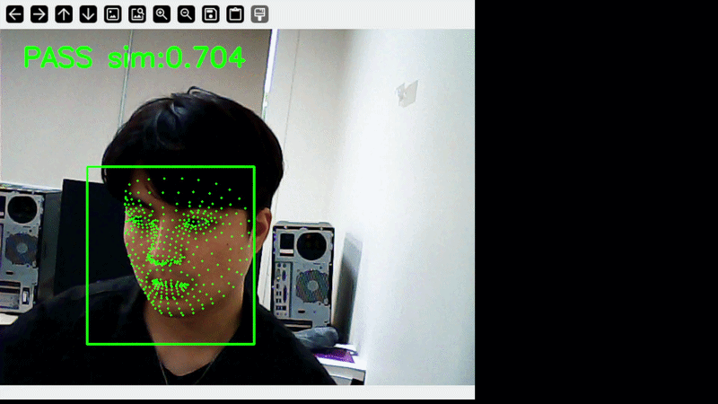
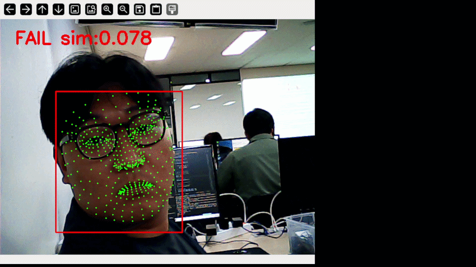
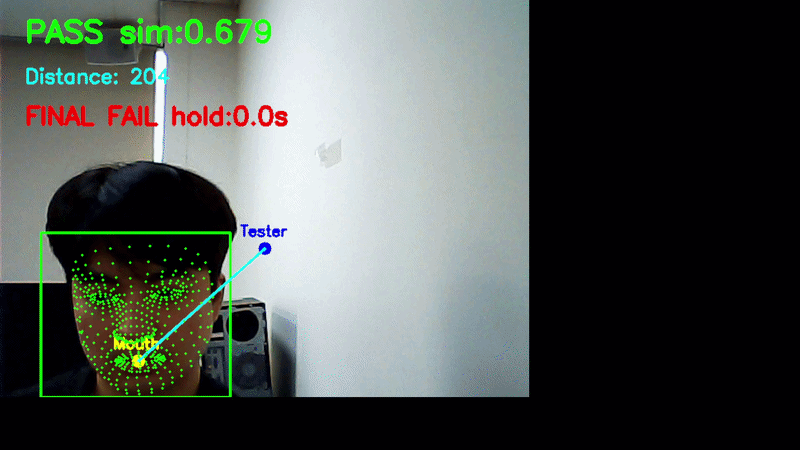

# Update 2026/5/12
- Mouth Landmark Tracking 구현
- 입 ↔ 측정기 거리 계산 기능 추가
- 고정형 음주 측정기 위치 감지 로직 구현

# MobileFaceNet Driver Authentication System

라즈베리파이 기반 얼굴 인증 및 음주 측정 연동 시스템 프로젝트입니다.


## 📌 프로젝트 상세

운전자 얼굴 인증 후,
고정형 음주 측정기와 입 위치를 비교하여
실제 운전자가 측정을 수행했는지 확인하는 시스템입니다.

MediaPipe FaceMesh를 이용하여 입 랜드마크를 추적하고,
고정된 측정기 위치와의 거리 계산을 통해
최종 인증 여부를 판별합니다.

### 주요 목표
- 얼굴 인증 기반 운전자 식별
- 타인의 대리 음주 측정 방지
- Raspberry Pi 기반 실시간 동작
- 향후 MQ-3 및 STM32 연동 예정

---

# 📷 Demo

## 실시간 얼굴 인증 화면

> 위 사람이 등록된 사람이라고 가정

### Pass 일 때



### Fail 일 때



### 고정형 음주 측정기 위치 감지

> 파란 점 : 고정된 측정기 위치  
> 노란 점 : 입 위치  
> Distance : 입 ↔ 측정기 거리



# 🧠 시스템 구조

```bash
Camera
 ↓
MediaPipe FaceMesh
(Face Alignment + Mouth Landmark)

 ↓
MobileFaceNet
(Face Embedding)

 ↓
Cosine Similarity

 ↓
Mouth ↔ Tester Distance Calculation

 ↓
FINAL PASS / FAIL
```

# 🔧 기술 스택

## AI / Vision
- MobileFaceNet (ONNX)
- MediaPipe FaceMesh
- OpenCV
- ONNX Runtime

## 하드웨어
- Raspberry Pi 5
- USB Camera
- MQ-3 (계획중)
- STM32 (계획중)

## 언어
- Python

# 📂 프로젝트 구조
```bash
mobile-facenet/
├── main.py
├── models/
│   └── w600k_mbf.onnx
├── register/
│   └── owner/
├── embeddings/
├── requirements.txt
└── README.md
```

# ⚙️ 기능

## ✅ 구현 완료 사항
- 실시간 얼굴 인증
- MediaPipe FaceMesh 기반 얼굴 정렬
- 얼굴 임베딩 생성
- 코사인 유사도 비교
- PASS / FAIL 인증 처리
- 입 위치 기반 고정 측정기 거리 계산
- FINAL PASS / FAIL 로직
- Mouth Landmark Tracking
- 라즈베리파이 이식 후 실행 완료

## 🚧 앞으로의 계획
- MQ-3 음주 센서 연동
- 실제 음주 측정 데이터 처리
- STM32 시동 제어
- 다중 얼굴 차단 기능
- 운전자 잠금 상태 시스템

# 🧩 인증 과정
1. MobileFaceNet 기반 운전자 얼굴 인증
2. FaceMesh 기반 입 위치 추적
3. 입 ↔ 측정기 거리 계산
4. 일정 시간 위치 유지
5. MQ-3 센서 값 감지
6. 최종 PASS

# 🚀 Installation

## Clone Repository

```bash
git clone https://github.com/your-repo/mobile-facenet.git
cd mobile-facenet
```

## 가상 환경 생성

```bash
python -m venv venv
```

## 가상 환경 실행

### Windows
```bash
venv\Scripts\activate
```

### Linux / Raspberry Pi
```bash
source venv/bin/activate
```

### 패키지 설치
```bash
pip install -r requirements.txt
```

## ▶️ 실행
```bash
python main.py
```

## 📝 참고 사항
- 안정적인 얼굴 정렬을 위해 MediaPipe FaceMesh를 사용했습니다.
- 라즈베리파이 환경에서의 경량 추론을 위해 MobileFaceNet을 선택했습니다.
- 얼굴 정렬 적용 후 얼굴 인증 성능이 크게 향상되었습니다.
- FaceMesh landmark를 이용하여 입 위치를 추적했습니다.
- 입 위치와 측정기 위치 간 pixel distance 계산을 통해 측정 동작을 판별했습니다.


## 👥 팀 역할

- 얼굴 인증: MobileFaceNet
- 얼굴 정렬: MediaPipe FaceMesh
- 라즈베리파이 연동
- 음주 감지 시스템


